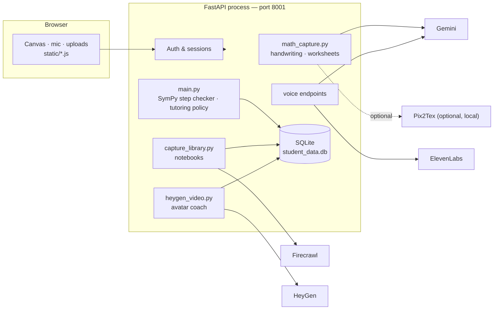

# Brighter Steps

**A single FastAPI app that turns handwriting, speech, and worksheet photos into a private, reviewed math tutoring session — no separate services, no duplicate accounts, nothing invented by the AI.**


One learner account, one private database, one process on port `8001`. Every AI-generated result — a photo transcription, a spoken formula, an imported worksheet, an avatar script — is shown to the student for explicit review before it's saved or used for grading.

## Contents

- [What it does](#what-it-does)
- [Architecture](#architecture)
- [Quickstart](#quickstart)
- [Configuration](#configuration)
- [Optional providers](#optional-providers)
- [API reference](#api-reference)
- [Testing](#testing)
- [Project layout](#project-layout)
- [Prototype limitations](#prototype-limitations)

## What it does

| Input | Flow |
|---|---|
| **Handwriting** | Draw on a pressure-aware touch/stylus canvas → transcribe with Gemini (or a pluggable OCR provider) → edit → review → submit. |
| **Voice** | Record or upload up to 60s of audio → transcribe with ElevenLabs → edit the transcript → format into LaTeX with Gemini → review each formula. |
| **Worksheet photo** | Upload a photo → Gemini extracts questions, diagrams, and LaTeX → edit and confirm each one before it's saved. |
| **Public lesson URL** | Import a page with Firecrawl → extracted questions are marked for review, nothing is invented for pages with no exercises. |
| **Guided practice** | Deterministic SymPy step-checking for Pythagoras and algebraic-equation problems, with adaptive Guided / Socratic / Worked-Example / Visual tutoring strategies. |
| **Avatar coach (optional)** | Turn the tutor's existing guidance into a narrated HeyGen video — narration only, it never changes the math or generates new content. |

Reviewed questions are saved to a private per-student notebook and can be exported to portable JSON and re-imported later. Nothing here grades or invents answers for arbitrary imported questions — see [Prototype limitations](#prototype-limitations).

## Architecture



Every outbound call is server-side only — provider keys and URLs never reach the browser. Raw photos and audio are never stored; only reviewed text, attempts, and video job metadata land in SQLite.

## Quickstart

Requires Python **3.11+** (developed and tested on 3.13).

```bash
python3 -m venv .venv
source .venv/bin/activate
pip install -r requirements.txt

cp .env.example .env   # optional — every provider key is optional

uvicorn main:app --reload --env-file .env --host 127.0.0.1 --port 8001
```

Open **http://127.0.0.1:8001/app/** for the full app.

| URL | Purpose |
|---|---|
| `/app/` | The full tutoring platform |
| `/` | Health check |
| `/docs` | Interactive API explorer (Swagger UI) |

No Node server, no port 3000, no Docker required for the base app — manual question entry and built-in Pythagoras/algebra practice work with zero API keys configured. Microphone access needs `localhost` or HTTPS. Supported image formats: PNG, JPEG, WebP, up to 6 MiB (no PDF/HEIC).

## Configuration

All keys are optional and stay server-side. Copy `.env.example` → `.env`, add only what you have, save, and restart the server (env vars load at process startup).

| Variable | Unlocks | Notes |
|---|---|---|
| `GEMINI_API_KEY` | Handwriting/worksheet OCR, spoken-math formatting | Used directly in-process; `GEMINI_MODEL` overrides the default model |
| `ELEVENLABS_API_KEY` | Voice transcription | Speech-to-Text access required |
| `FIRECRAWL_API_KEY` | Import problems from a public lesson URL | Private/local/IP/custom-port URLs are always rejected |
| `HEYGEN_API_KEY` | Avatar coach videos | See [Optional providers](#optional-providers) |
| `HEYGEN_AVATAR_ID` / `HEYGEN_VOICE_ID` | Default avatar/voice | Optional — otherwise pick one in the app |
| `TEAM_OCR_URL` / `TEAM_OCR_NAME` | Swap in a teammate's OCR service | See adapter contract below |
| `INKMATH_OCR_URL` | Point handwriting OCR at a legacy external service | Leave empty to use the built-in Gemini provider |
| `PIX2TEX_URL` | Override the local Pix2Tex address | Defaults to `http://127.0.0.1:8502/predict/` |
| `DEFAULT_OCR_PROVIDER` | `inkmath` (default) / `team-ocr` / `local-pix2tex` | Which OCR engine loads by default |

## Optional providers

<details>
<summary><strong>Self-hosted handwriting OCR — Pix2Tex</strong></summary>

Runs [Pix2Tex / LaTeX-OCR](https://github.com/lukas-blecher/LaTeX-OCR) locally, no API key needed.

```bash
docker compose up ocr    # start once, Docker Desktop running
```

Start the FastAPI app as usual in a second terminal. The first model load takes a while while its checkpoint downloads. Select **Local Pix2Tex** from the notebook's OCR-provider toggle.

</details>

<details>
<summary><strong>Teammate's OCR service — Team OCR</strong></summary>

Set `TEAM_OCR_URL` in `.env` and restart. The browser never sees the URL or any credentials — it's a server-side adapter only.

Your service must accept:

```json
{ "imageData": "data:image/png;base64,...", "sessionId": "...", "stepIndex": 0 }
```

and return:

```json
{ "rawLatex": "a^2 + b^2 = c^2", "confidence": 0.91, "provider": "Teammate OCR" }
```

Different field names or multipart uploads? Adapt only `recognize_with_team_ocr` in `main.py` — the tablet UI and checker stay unchanged. (`OCR_SERVICE_URL` still works as a legacy alias for `TEAM_OCR_URL`.)

</details>

<details>
<summary><strong>Avatar coach — HeyGen</strong></summary>

Narrates the tutor's *existing* guidance as a video. It does not change the math checker, generate new lesson content, or render diagrams.

1. Add `HEYGEN_API_KEY` to `.env`, save, restart.
2. Sign in, open a practice topic, choose **Turn coach guidance into a video**.
3. Review the auto-populated script (max 4,000 characters, spell out symbols for pronunciation, strip any personal details), pick a public avatar, confirm the credit-use checkbox, and generate.
4. Status polls every 8s for up to 10 minutes while the dialog is open; reopen it anytime to resume, or use **Check status**.

**Safeguards:** nothing generates on page load or avatar selection — every draft needs explicit review and confirmation. Submissions carry a stable idempotency key plus a local uniqueness check, so retrying an unchanged draft reuses the existing request instead of paying twice. Retries stop being treated as safe after 23 hours (HeyGen's window is 24h) — check HeyGen's dashboard for an unconfirmed job after a reload instead of resubmitting. Capped at 3 active/unconfirmed jobs per learner per rolling day. Closing the dialog pauses polling but does **not** cancel an already-submitted render.

Only job IDs, ownership, status, timestamps, and a request fingerprint are stored locally — never scripts, provider keys, or video bytes. Only the reviewed script and chosen avatar/voice IDs are sent to HeyGen; learner profile data is not.

Reference: [Create video](https://developers.heygen.com/reference/create-video) · [Video status](https://developers.heygen.com/reference/get-video) · [Avatar looks](https://developers.heygen.com/reference/list-avatar-looks)

</details>

## API reference

| Method & path | Purpose |
|---|---|
| `POST /auth/register`, `POST /auth/login`, `POST /auth/logout` | Learner account & session cookie |
| `POST /check-step` | SymPy-graded check for a built-in Pythagoras/algebra step |
| `POST /learning-sessions`, `POST /learning-sessions/{id}/steps` | Start and record a guided practice session |
| `GET /learning-sessions/{id}/review` | Session review/history |
| `POST /recognize-handwriting`, `POST /recognize-handwriting/inkmath` | Handwriting OCR (pluggable provider / InkMath-specific) |
| `POST /voice/transcribe`, `POST /voice/math-json` | Audio → transcript → reviewed LaTeX |
| `POST /import-problem-url` | Extract reviewable questions from a public lesson URL |
| `GET/POST /api/notebooks`, `POST /api/notebooks/{id}/questions/{i}/practice` | Private reviewed-question notebooks |
| `GET /api/heygen/config`, `GET /api/heygen/avatars`, `POST /api/heygen/videos`, `GET /api/heygen/videos` | Avatar coach videos |

Full interactive docs at `/docs`. Manual example:

```bash
curl -X POST http://127.0.0.1:8001/check-step \
  -H 'Content-Type: application/json' \
  -d '{
    "sessionId": "abc123",
    "stepIndex": 2,
    "problemId": "pythagoras_01",
    "rawLatex": "a + b^2 = c^2",
    "confidence": 0.91,
    "timestamp": 1234567890
  }'
```

Response reports `correct`, `error`, or `unclear` (OCR confidence below `0.6` returns `unclear` without parsing). `errorType` is for code; show the plain-language `hint` to the student.

## Testing

```bash
pytest                          # backend: providers, auth, notebooks, tutoring, HeyGen ownership/idempotency
node --test tests/*.test.mjs    # frontend: drawing, review consent, session/network edge cases
```

Tests run against a temporary SQLite database and block unmocked outbound network calls — no paid live provider calls are made. Configured-account access, real billing, and actual microphone/stylus/avatar rendering still need manual verification.

## Project layout

```
main.py              FastAPI app, auth, SymPy step checker, tutoring policy
math_capture.py       Gemini-backed handwriting/worksheet OCR + schema validation
capture_library.py    Private reviewed-question notebooks
heygen_video.py        Avatar coach provider adapter
static/                Frontend: canvas, voice, capture UI, app shell
tests/                 pytest + node --test suites
compose.yaml            Optional local Pix2Tex OCR service
```

## Prototype limitations

- **Imported/manual questions are self-guided and ungraded.** Their steps are saved, not checked against a known answer, and the coach makes no correctness/completion claims for them. Only the built-in Pythagoras/algebra problems are SymPy-graded.
- Diagram descriptions are transcribed text, not reconstructed images.
- Dashboard percentages are labelled prototype examples, not measured mastery.
- Curriculum context rules (`curriculum_context_for` in `main.py`) are a small starter policy — replace with verified country/state curriculum data before real use.
- This is a local prototype: before deploying anywhere public, add HTTPS/secure cookies, trusted-host/proxy config, rate limiting, account recovery, and a managed database. Capture limits are per-process, not deployment-wide.
